# dnc-identity-identityserver

An example of:

- Integrate [IdentityServer4](http://docs.identityserver.io/en/latest/) with [ASP.NET Core Identity](https://docs.microsoft.com/en-us/aspnet/core/security/authentication/identity?view=aspnetcore-3.1&tabs=visual-studio)
- Integrate [Ocelot](https://github.com/ThreeMammals/Ocelot) as ApiGateway (in term of Microservices) with [Consul](https://www.consul.io/) for service discovery

## Getting Started

### Start Consul

- Download [Consul](https://releases.hashicorp.com/consul/1.6.2/consul_1.6.2_windows_amd64.zip) for Windows
- Unzip to the path, for example, **`C:\Consul`**. Then add this path to the **PATH** environment
- Fire up Consul with the following command line

```
	consul agent -dev
```

- Open browser with the link `http://localhost:8500`

### Start Services

- Modify the connection string in `DncIds4.IdentityServer > appsettings.Development.json`
- Configure solution to run multiple project

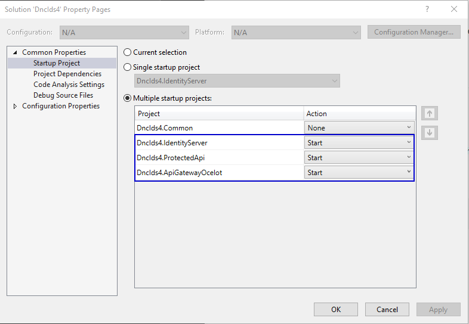

- Fire up by `Ctrl + F5`
- Back to browser with the link `http://localhost:8500` to verify these services has been registered to Consul

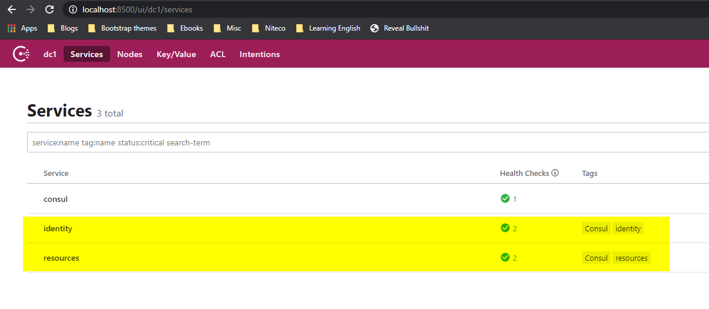

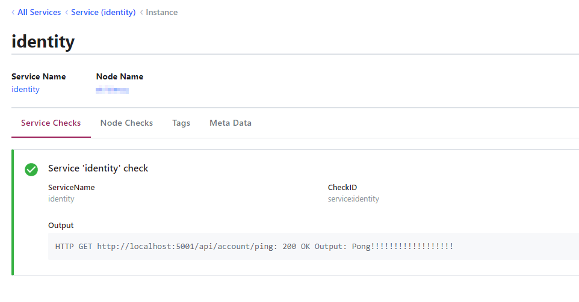

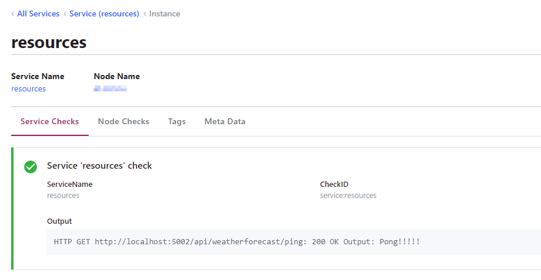

## Use Postman

### Account Registration

**1. Request a token**

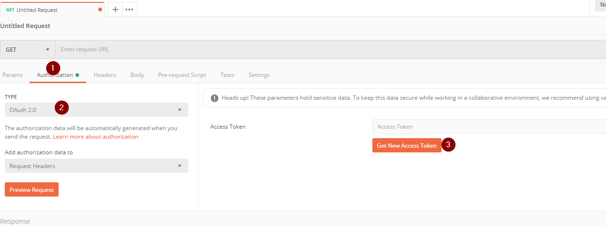

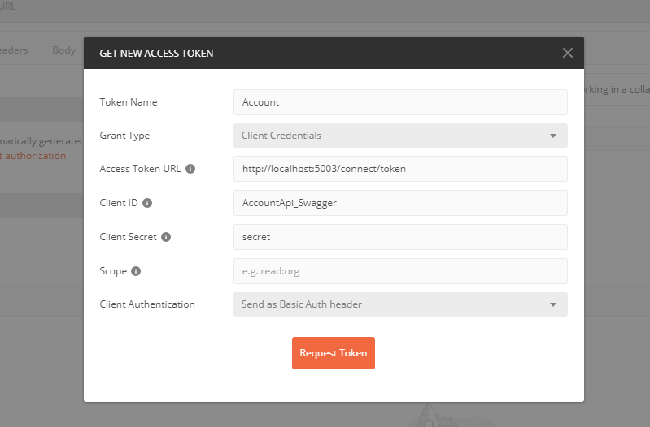

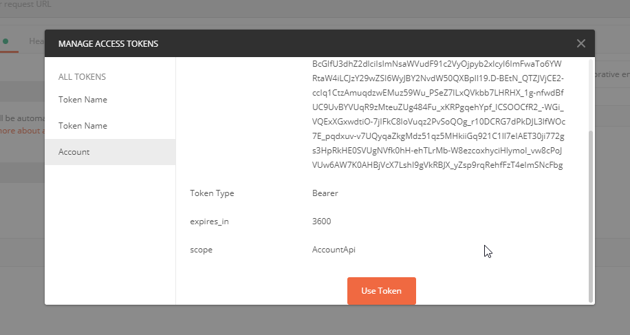

**2. Register new account**

- Endpoint: `http://localhost:5003/account/register`
- Json body

```json
{
  "username": "kim.admin",
  "emailAddress": "kim.admin@mail.com",
  "password": "Kimadmin@123",
  "isAdmin": true
}
```

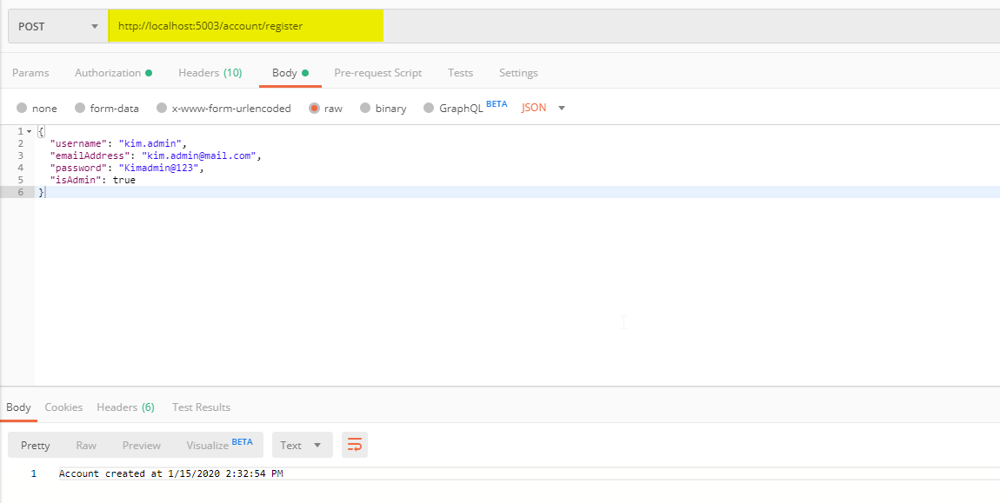

### Login and retrieve weather information

**1. Request a token**

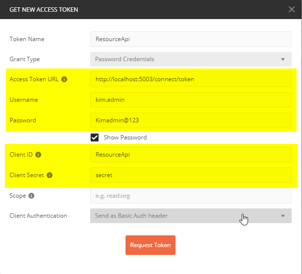

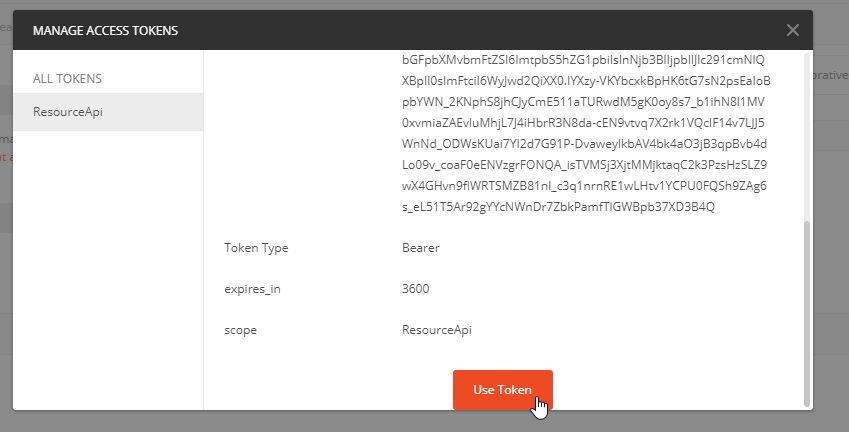

**2. Get weather forecast information**

- Endpoint: `http://localhost:5003/weather/forecast`

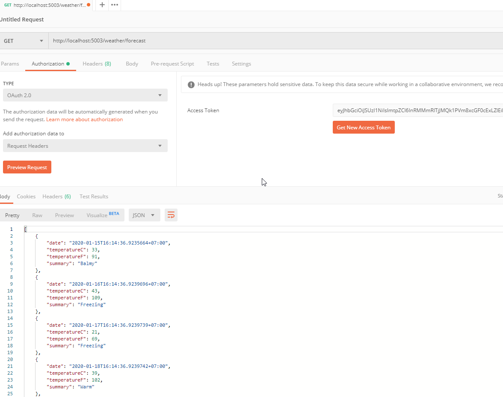

## Highlighted Points

1. Use `IHostedService` to 

- Do database migration by following the link - [Running async tasks on app startup in ASP.NET Core 3.0](https://andrewlock.net/running-async-tasks-on-app-startup-in-asp-net-core-3/)
- Automatically register service to Consul by following the link - [API Gateway using .NET Core, Ocelot and Consul](https://tinyurl.com/yenme2t5)